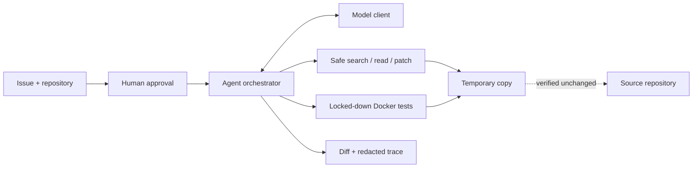

# RepoPilot

[English](README.md) | [简体中文](README.zh-CN.md)

> A safety-first coding agent that turns a failing issue into a tested, reviewable diff without changing the source repository.

[](https://github.com/pxxxzzzl-arch/RepoPilot/actions/workflows/ci.yml)
[](https://www.python.org/)
[](LICENSE)

**RepoPilot** is the product. **`issue2patch`** is its Python package and CLI command.

## What it does

Given a repository and an issue, RepoPilot:

1. asks for explicit human approval;
2. copies the repository into a temporary workspace;
3. runs the failing baseline tests in a locked-down Docker container;
4. lets the model use only five structured actions: search, read, patch, test, and finish;
5. validates SHA-256 guarded patches and reruns the tests;
6. returns a unified diff and redacted audit trace.

The original repository is verified before return and is never modified. RepoPilot does not execute model-provided shell commands, apply the final diff, commit code, push a branch, or open a pull request.

## Verified live evidence

The first successful live run used DeepSeek and GitHub-hosted Docker on 6 September 2026. It reproduced the broken test, read the target file with its SHA-256, generated a valid patch, passed the isolated tests, returned a one-file diff, and verified that the source copy was unchanged.

| Evidence | Result |
|---|---:|
| Live end-to-end run | [GitHub Actions #3](https://github.com/pxxxzzzl-arch/RepoPilot/actions/runs/34025422134) — passed |
| Model | `deepseek-v4-flash` |
| Agent path | 5 actions, 5 API requests, 0 retries |
| Usage | 6,390 tokens · 8.377 s · estimated $0.001181 |
| Output | `calculator.py` only; source repository unchanged |

A 10-task × 1-run qualification benchmark achieved **80% repair success**, **0 unrelated file changes**, **0 timeouts**, and **0 patch conflicts**. Both failures were invalid model output and were rejected before execution. The final 10-task × 3-run report will be published as [JSON](eval-results/eval-report.json) and [Markdown](eval-results/eval-report.md); the report files, not this summary, are the source of truth.

## Run the broken example

Requirements: Python 3.10+, Docker, and a DeepSeek API key. Keep the key in the environment only.

```bash
python3 -m venv .venv
source .venv/bin/activate
python -m pip install -e ".[dev]"
docker build -f docker/sandbox.Dockerfile -t issue2patch-sandbox:py311 .

export DEEPSEEK_API_KEY="your-key"
workdir="$(mktemp -d)"
cp -R examples/broken_calculator/. "$workdir/"
issue2patch run --provider deepseek --repo "$workdir" \
  --issue "divide should return quotient"
```

The CLI displays the provider, model, repository, security boundary, and possible API charge before asking for approval. Progress goes to stderr; stdout contains only the diff. For an already approved non-interactive run, add `--approve`.

OpenAI is also supported with `OPENAI_API_KEY` and `--provider openai`.

## Security boundaries

| Threat | Control |
|---|---|
| Arbitrary model execution | No shell action; strict structured action schema |
| Repository escape | Reject absolute paths, `..`, Windows absolute paths, and symlinks |
| Stale or partial writes | SHA-256 preconditions, full preflight, size limits, atomic multi-file writes |
| Malicious tests | No network, non-root user, read-only root/repository mount, no capabilities, CPU/memory/PID/time limits |
| Secret or source leakage | Keys are environment-only; traces omit source bodies, diffs, environment variables, and hidden reasoning |
| Source repository mutation | Fresh temporary copy plus before/after source snapshot verification |

The local runner is explicitly named `run_tests_trusted`; Docker is the default boundary for untrusted repositories.

## Architecture



See [architecture](docs/architecture.md) and [design decisions](docs/decisions.md).

## Evaluation

The fixed suite contains 10 deliberately broken Python repositories. Each run gets a fresh model client and working copy. A repair counts only when the Agent finishes successfully, tests pass, the source repository remains unchanged, and no file outside the task allowlist changes.

```bash
issue2patch eval --provider deepseek --suite evals/suite.json \
  --runs 3 --output eval-results
```

The qualification run exposed two useful failure modes: one response contained more than one action field, and another was not valid JSON. Both ended as `invalid_action`; neither response was executed. These failures are retained in the report rather than hidden from the success rate.

## Current scope

- Works today: OpenAI and DeepSeek Responses clients, structured actions, auditable atomic patches, Docker testing, CLI, and repeatable evals.
- Current benchmark: small Python defects, mainly single-file fixes.
- Not implemented: importing GitHub Issues, creating branches, or opening pull requests.
- Docker reduces risk but cannot eliminate container-runtime or kernel vulnerabilities.

## Development

```bash
python -m pip install -e ".[dev]"
pytest -q
python -m build
```

Root `pytest` collects only `tests/`. Intentionally broken fixtures under `evals/tasks/` and `examples/broken_calculator/` run only when explicitly targeted. Paid API smoke tests are opt-in and are never run by normal CI.

[Contributing](CONTRIBUTING.md) · [Security policy](SECURITY.md) · [MIT License](LICENSE)
