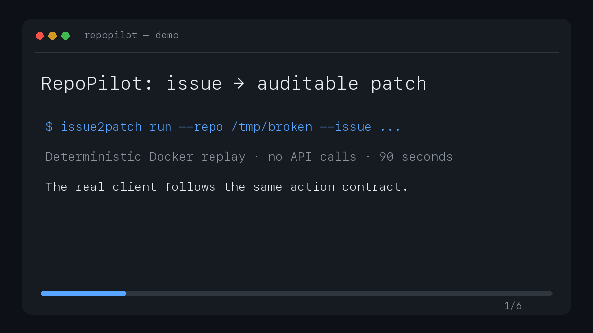
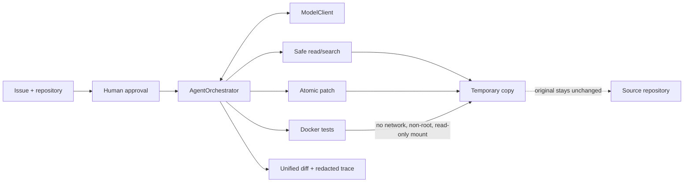

# RepoPilot

> An auditable AI coding agent that turns a failing GitHub-style issue into a reviewable patch without modifying the source repository.

[](https://github.com/pxxxzzzl-arch/RepoPilot/actions/workflows/ci.yml)
[](https://www.python.org/)
[](LICENSE)

**RepoPilot** is the product and repository name. **`issue2patch`** remains the Python package and CLI command so existing integrations keep a stable interface.

RepoPilot gives a model five structured actions—search, read, patch, test, finish—and no shell. It works on a temporary copy, runs untrusted tests in a locked-down Docker container, records a redacted audit trail, and returns only a unified diff for human approval.

## 90-second demo



The demo is a reproducible animated terminal walkthrough generated by `scripts/render_demo_gif.py`. Its caption states that it is a deterministic replay rather than a paid live-model run; neither mode writes to the source repository.

Regenerate it with `python -m pip install -e ".[demo]" && python scripts/render_demo_gif.py`.

## Architecture in one screen



[Detailed architecture](docs/architecture.md) · [Design decisions](docs/decisions.md)

## Run it

Prerequisites: Python 3.10+, Docker, a locally built sandbox image, and `OPENAI_API_KEY`.

```bash
python -m pip install -e ".[dev]" && \
docker build -f docker/sandbox.Dockerfile -t issue2patch-sandbox:py311 . && \
workdir="$(mktemp -d)" && cp -R examples/broken_calculator/. "$workdir/" && \
issue2patch run --repo "$workdir" --issue "divide should return quotient"
```

The CLI shows the repository, model, execution boundary, and possible API charge before asking for approval. For an explicitly approved non-interactive run, add `--approve`. Progress and usage go to stderr; stdout contains only the diff.

## Security boundaries

| Risk | Fail-closed control |
|---|---|
| Model asks for arbitrary execution | No shell action exists; strict JSON Schema accepts only five action types |
| Path traversal or repository escape | Absolute paths, `..`, Windows absolute paths, and symlinks are rejected |
| Stale or destructive edit | Reads return SHA-256; patches require the exact hash, full preflight, size limits, and atomic writes |
| Malicious tests | Docker has no network, runs non-root, drops all capabilities, uses a read-only root and repository mount, and enforces CPU/memory/PID/time limits |
| Secret/source leakage | API key is environment-only; traces omit environment variables, full source, diffs, and hidden reasoning |
| Partial or original-repository modification | Every run uses a fresh temporary copy; multi-file writes roll back; the source snapshot is verified before return |

The local runner is intentionally named `run_tests_trusted`; it is not the default for untrusted repositories.

## Evaluation

The fixed suite contains 10 deliberately broken Python repositories. Each task runs three times with a fresh model client and working copy. A **repair success** requires all four conditions: Agent status `SUCCESS`, tests pass, the source repository is unchanged, and no file outside the task allowlist is modified.

```bash
issue2patch eval --suite evals/suite.json --runs 3 --output eval-results
```

### Latest live result

| Model | Tasks × runs | Repair success | Test pass | Unrelated files | Avg tools | Tokens | Time | Cost |
|---|---:|---:|---:|---:|---:|---:|---:|---:|
| `gpt-5.6-luna` | 10 × 3 | _Awaiting credentialed run_ | — | — | — | — | — | — |

The row is intentionally not populated from mocks. After a real run, the committed [JSON report](eval-results/eval-report.json) is the source of truth and the [Markdown report](eval-results/eval-report.md) is the human-readable view.

The default model and estimator use the published [GPT-5.6 Luna model ID and token prices](https://developers.openai.com/api/docs/models/gpt-5.6-luna); every report records the exact model name and UTC generation time.

### Evidence available without paid API access

| Check | Result |
|---|---:|
| Offline project tests | 91 passed, 5 opt-in integration tests skipped |
| Fixed broken tasks | 10/10 fail before repair |
| Repeated deterministic repair test | 3/3 strict successes |
| Docker and live Responses API | Must be recorded on a host with Docker and `OPENAI_API_KEY` |

## One successful case

The `divide` fixture starts with `return a * b`. The deterministic Agent test reads `calculator.py`, receives its SHA-256 metadata, applies `return a / b` in a temporary copy, reruns pytest, and returns a one-file diff. The fixture and caller's repository remain byte-for-byte unchanged. This same path is used by the real model client; only action selection changes.

## One failure case and the improvement it caused

An early `PatchAction` contract required `expected_sha256`, but `ReadFileAction` exposed only source text. A model cannot reliably calculate SHA-256, so real runs would end in `PATCH_CONFLICT`. Reads now return `{path, sha256, bytes}` as separate metadata, the model must echo that hash, and audit logs record the hash without recording source. Regression tests cover both a metadata-driven success and a deliberately stale-hash conflict.

## Evaluation outputs

Both reports include per-run status plus aggregate success, test pass rate, unrelated modifications, tool calls, input/cached/output tokens, model and wall-clock time, estimated cost, timeouts, patch conflicts, security blocks, and termination reasons. They exclude source, diffs, API keys, environment variables, and hidden reasoning.

## Development

```bash
python3 -m venv .venv
source .venv/bin/activate
python -m pip install -e ".[dev]"
pytest -q
python -m build
```

Root `pytest` collects only `tests/`. The intentionally broken Agent fixtures under `evals/tasks/` and `examples/broken_calculator/` run only when explicitly targeted. The repaired historical `demo_repo` remains green.

Real API smoke tests are paid and opt-in:

```bash
ISSUE2PATCH_RUN_LIVE_API=1 pytest tests/test_live_api_smoke.py
```

Normal GitHub Actions never provide an API key or enable paid tests. CI covers Python 3.10–3.12, package build/metadata checks, and Docker image construction.

## Project map

| Path | Responsibility |
|---|---|
| `src/issue2patch/orchestrator.py` | Temporary-copy Agent state machine and termination reasons |
| `src/issue2patch/models.py` | Provider-independent protocol and strict OpenAI Responses client |
| `src/issue2patch/tools.py` | Contained read, fixed-string search, trusted tests, and diff |
| `src/issue2patch/patching.py` | Validated, hash-guarded, atomic patches |
| `src/issue2patch/sandbox.py` | Docker command construction, limits, timeout, and cleanup |
| `src/issue2patch/evals.py` | Repeated evaluation, strict metrics, and JSON/Markdown reports |
| `evals/` | Ten immutable broken-task fixtures and suite manifest |

## Scope and known limitations

- The default real client currently targets OpenAI Responses API; the orchestration protocol remains provider-independent.
- RepoPilot outputs a diff but does not apply it, commit it, push a branch, or create a pull request.
- Docker substantially reduces risk but is not a guarantee against every container-runtime or kernel vulnerability.
- The current benchmark contains small, single-file Python repairs. Multi-file and dependency-changing tasks are planned.
- Live success rates vary with model snapshots, prompts, account limits, and service conditions; reports include their timestamp and model.

## Community

[Contributing](CONTRIBUTING.md) · [Security policy](SECURITY.md) · [MIT License](LICENSE)
