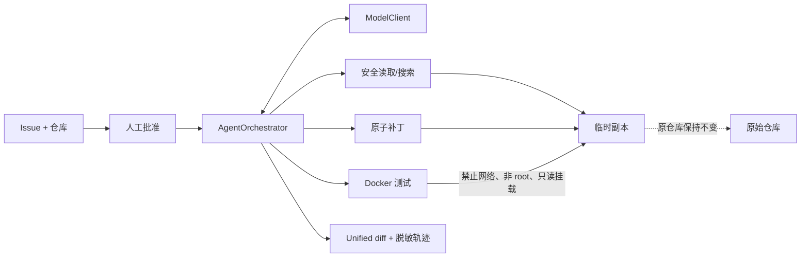

# RepoPilot

[English](README.md) | [简体中文](README.zh-CN.md)

> 一个可审计的 AI 编程 Agent：将一条会触发失败测试的 GitHub 风格 Issue 转换为可审查补丁，全程不修改原始仓库。

[](https://github.com/pxxxzzzl-arch/RepoPilot/actions/workflows/ci.yml)
[](https://www.python.org/)
[](LICENSE)

**RepoPilot** 是产品与 GitHub 仓库名称。**`issue2patch`** 仍是 Python 包名与 CLI 命令，用于保持现有集成的稳定。

RepoPilot 只向模型提供五种结构化动作：搜索、读取、补丁、测试和完成，不提供 Shell。Agent 在临时副本中工作，在锁定的 Docker 容器中运行不可信测试，生成脱敏审计轨迹，最终只输出 unified diff 供人工批准。

## 90 秒演示


该 GIF 由 `scripts/render_demo_gif.py` 生成，是可重现的确定性演示，不是付费的真实模型运行。无论演示还是真实运行，都不会写入原始仓库。

重新生成：

```bash
python -m pip install -e ".[demo]"
python scripts/render_demo_gif.py
```

## 架构概览



[详细架构](docs/architecture.md) · [设计决策](docs/decisions.md)

## 运行

需要 Python 3.10+、Docker、本地构建的沙箱镜像，以及所选模型供应商的 API Key。DeepSeek 需要显式选择，并且只读取 `DEEPSEEK_API_KEY`：

```bash
export DEEPSEEK_API_KEY="your-deepseek-key"
python -m pip install -e ".[dev]" && \
docker build -f docker/sandbox.Dockerfile -t issue2patch-sandbox:py311 . && \
workdir="$(mktemp -d)" && cp -R examples/broken_calculator/. "$workdir/" && \
issue2patch run --provider deepseek --repo "$workdir" \
  --issue "divide should return quotient"
```

DeepSeek 默认模型是 `deepseek-v4-flash`，可使用 `--model` 覆盖。如需使用 OpenAI，请导出 `OPENAI_API_KEY` 并传入 `--provider openai`（当前默认供应商）。

CLI 会在请求批准前展示供应商、仓库、模型、执行边界和可能产生的 API 费用。非交互运行需要显式添加 `--approve`。进度和用量写入 stderr，stdout 只包含 diff。不要将 API Key 写入源码、命令行参数、Issue 或日志。

## 安全边界

| 风险 | 默认拒绝的控制措施 |
|---|---|
| 模型请求任意执行 | 不存在 Shell Action；严格 JSON Schema 只接受五种动作 |
| 路径穿越或逃离仓库 | 拒绝绝对路径、`..`、Windows 绝对路径和符号链接 |
| 过期或破坏性修改 | 读取返回 SHA-256；补丁必须提供精确哈希，并通过全量预检、大小限制和原子写入 |
| 恶意测试 | Docker 禁止网络，以非 root 用户运行，删除所有 capabilities，只读挂载根文件系统和仓库，并限制 CPU、内存、PID 和时间 |
| 密钥或源码泄露 | API Key 只从环境变量读取；轨迹不记录环境变量、完整源码、diff 和隐藏推理 |
| 部分修改或原仓库被改动 | 每次运行都使用新的临时副本；多文件失败时回滚；返回前验证原始快照 |

本地测试器被明确命名为 `run_tests_trusted`，它不是不可信仓库的默认选项。

## 评测

固定评测集包含 10 个故意损坏的 Python 仓库。每个任务使用全新的模型客户端和工作副本运行 3 次。只有同时满足以下条件才算**修复成功**：Agent 状态为 `SUCCESS`、测试通过、原始仓库未改变，且没有修改任务白名单外的文件。

```bash
issue2patch eval --provider deepseek --suite evals/suite.json \
  --runs 3 --output eval-results
```

### 最新真实评测

| 模型 | 任务 × 次数 | 修复成功率 | 测试通过率 | 非相关文件 | 平均工具数 | Token | 耗时 | 费用 |
|---|---:|---:|---:|---:|---:|---:|---:|---:|
| `gpt-5.6-luna` | 10 × 3 | _等待有凭据的真实运行_ | — | — | — | — | — | — |
| `deepseek-v4-flash` | 10 × 3 | _等待有凭据的真实运行_ | — | — | — | — | — | — |

表格不会使用 Mock 结果填充。完成真实运行后，已提交的 [JSON 报告](eval-results/eval-report.json) 是事实来源，[Markdown 报告](eval-results/eval-report.md) 用于人工阅读。

费用估算使用已公布的 [GPT-5.6 Luna 价格](https://developers.openai.com/api/docs/models/gpt-5.6-luna) 或 DeepSeek [当前峰谷价格](https://api-docs.deepseek.com/quick_start/pricing/)。每份报告都记录确切模型名称和 UTC 生成时间。由于供应商可能改变价格，费用仍为估算值。

### 无付费 API 时可验证的证据

| 检查 | 结果 |
|---|---:|
| 离线项目测试 | 97 通过，6 个可选集成测试跳过 |
| 固定故障任务 | 10/10 在修复前失败 |
| 重复确定性修复测试 | 3/3 严格成功 |
| Docker 和真实 Responses API | 必须在具有 Docker 和所选供应商密钥的机器上记录 |

## 成功案例

`divide` 故障样例初始包含 `return a * b`。确定性 Agent 测试读取 `calculator.py`，获取 SHA-256 元数据，在临时副本中将它修改为 `return a / b`，重新运行 pytest，并返回只修改一个文件的 diff。故障样例和调用者仓库保持字节级不变。真实模型客户端使用相同路径，只有动作选择方式不同。

## 失败案例与改进

早期 `PatchAction` 合约要求 `expected_sha256`，但 `ReadFileAction` 只暴露文件内容。模型无法可靠地计算 SHA-256，因此真实运行会以 `PATCH_CONFLICT` 终止。现在读取操作将 `{path, sha256, bytes}` 作为独立元数据返回，模型必须原样回传哈希；审计日志只记录哈希，不记录源码。回归测试同时覆盖了元数据驱动的成功路径和故意传入过期哈希的冲突路径。

## 评测输出

JSON 和 Markdown 报告均包含每次运行的状态，以及汇总修复成功率、测试通过率、非相关修改数、工具调用数、输入/缓存/输出 Token、模型和总耗时、估算费用、超时、补丁冲突、安全拦截和终止原因。报告不包含源码、diff、API Key、环境变量或隐藏推理。

## 开发

```bash
python3 -m venv .venv
source .venv/bin/activate
python -m pip install -e ".[dev]"
pytest -q
python -m build
```

在根目录运行 `pytest` 只收集 `tests/`。`evals/tasks/` 和 `examples/broken_calculator/` 下故意失败的 Agent 样例只会在显式指定时执行。已修复的历史 `demo_repo` 保持绿色。

真实 API smoke test 会产生费用，因此默认跳过：

```bash
ISSUE2PATCH_RUN_LIVE_API=1 pytest tests/test_live_api_smoke.py
ISSUE2PATCH_RUN_DEEPSEEK_LIVE_API=1 pytest tests/test_deepseek_live_api_smoke.py
```

普通 GitHub Actions 不会提供 API Key，也不会启用付费测试。CI 覆盖 Python 3.10–3.12、包构建/元数据检查和 Docker 镜像构建。

有凭据的真实评测位于只能手动触发的 **Live Agent Evaluation** 工作流中。请在 **Settings → Secrets and variables → Actions** 下将 `DEEPSEEK_API_KEY` 或 `OPENAI_API_KEY` 添加为仓库 Secret，然后选择对应的供应商、可选模型和运行次数。Secret 不会作为工作流输入、不会被打印、上传或写入报告；普通 push 也无法触发该付费工作流。发布成功报告仍需要单独明确选择。

## 项目目录

| 路径 | 职责 |
|---|---|
| `src/issue2patch/orchestrator.py` | 临时副本 Agent 状态机和终止原因 |
| `src/issue2patch/models.py` | 供应商无关协议，以及严格的 OpenAI/DeepSeek Responses 客户端 |
| `src/issue2patch/tools.py` | 边界内读取、固定字符串搜索、可信测试和 diff |
| `src/issue2patch/patching.py` | 经验证、哈希保护、原子化的补丁 |
| `src/issue2patch/sandbox.py` | Docker 命令构造、资源限制、超时与清理 |
| `src/issue2patch/evals.py` | 重复评测、严格指标与 JSON/Markdown 报告 |
| `evals/` | 10 个不可变故障任务样例和评测集清单 |

## 范围与已知限制

- 真实客户端支持 OpenAI 和 DeepSeek Responses API；编排协议和本地 Action 验证仍与供应商无关。
- RepoPilot 只输出 diff，不会应用它、提交它、推送分支或创建 Pull Request。
- Docker 可显著降低风险，但无法保证防御所有容器运行时或内核漏洞。
- 当前基准主要是小型、单文件 Python 修复。多文件和依赖修改任务尚在规划中。
- 真实成功率会受模型快照、Prompt、账户限制和服务状态影响；报告会记录时间和模型。

## 参与贡献

[贡献指南](CONTRIBUTING.md) · [安全政策](SECURITY.md) · [MIT 许可证](LICENSE)
