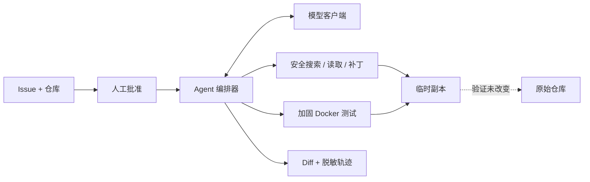

# RepoPilot

[English](README.md) | [简体中文](README.zh-CN.md)

> 一个安全优先的编程 Agent：把会触发失败测试的 Issue 转换为经过测试、可人工审查的 Diff，全程不修改原始仓库。

[](https://github.com/pxxxzzzl-arch/RepoPilot/actions/workflows/ci.yml)
[](https://www.python.org/)
[](LICENSE)

**RepoPilot** 是产品名称，**`issue2patch`** 是 Python 包名和 CLI 命令。

## 它做什么

输入一个代码仓库和一条 Issue 后，RepoPilot 会：

1. 请求明确的人工批准；
2. 将仓库复制到临时工作区；
3. 在加固的 Docker 容器中运行基准测试，确认故障存在；
4. 只允许模型执行搜索、读取、补丁、测试和完成五种结构化动作；
5. 验证带 SHA-256 前置条件的补丁，并重新运行测试；
6. 返回 unified diff 和脱敏审计轨迹。

返回前会再次验证原始仓库没有变化。RepoPilot 不执行模型生成的 Shell 命令，不自动应用最终 Diff，也不会提交代码、推送分支或创建 Pull Request。

## 已验证的真实运行

2026 年 9 月 6 日，项目第一次使用 DeepSeek 和 GitHub 托管的 Docker 完成真实端到端验证：故障测试先失败，模型读取目标文件及其 SHA-256，生成合法补丁，隔离测试随后通过，最终只输出一个文件的 Diff，并确认源仓库保持不变。

| 证据 | 结果 |
|---|---:|
| 真实端到端运行 | [GitHub Actions #3](https://github.com/pxxxzzzl-arch/RepoPilot/actions/runs/34025422134) — 通过 |
| 模型 | `deepseek-v4-flash` |
| Agent 路径 | 5 个动作，5 次 API 请求，0 次重试 |
| 用量 | 6,390 Token · 8.377 秒 · 估算 $0.001181 |
| 输出 | 仅修改 `calculator.py`；原始仓库不变 |

10 个任务各运行 1 次的资格评测得到 **80% 修复成功率**、**0 个非相关文件修改**、**0 次超时**和 **0 次补丁冲突**。两次失败都是非法模型输出，并在执行前被拒绝。最终 10 个任务 × 3 次的报告会发布为 [JSON](eval-results/eval-report.json) 和 [Markdown](eval-results/eval-report.md)；报告文件是事实来源，本页只做摘要。

## 运行故障样例

需要 Python 3.10+、Docker 和 DeepSeek API Key。Key 只能保存在环境变量中。

```bash
python3 -m venv .venv
source .venv/bin/activate
python -m pip install -e ".[dev]"
docker build -f docker/sandbox.Dockerfile -t issue2patch-sandbox:py311 .

export DEEPSEEK_API_KEY="your-key"
workdir="$(mktemp -d)"
cp -R examples/broken_calculator/. "$workdir/"
issue2patch run --provider deepseek --repo "$workdir" \
  --issue "divide should return quotient"
```

CLI 会先显示供应商、模型、仓库、安全边界和可能产生的 API 费用，再请求批准。进度写入 stderr，stdout 只输出 Diff。已经明确批准的非交互运行可以添加 `--approve`。

项目也支持 OpenAI：设置 `OPENAI_API_KEY` 并使用 `--provider openai`。

## 安全边界

| 威胁 | 控制措施 |
|---|---|
| 模型请求任意执行 | 不提供 Shell Action；只接受严格的结构化动作 |
| 逃离仓库目录 | 拒绝绝对路径、`..`、Windows 绝对路径和符号链接 |
| 过期补丁或部分写入 | SHA-256 前置条件、全量预检、大小限制和多文件原子写入 |
| 恶意测试 | 禁止网络、非 root、只读根文件系统和仓库挂载、删除 capabilities，并限制 CPU、内存、PID 和时间 |
| 密钥或源码泄露 | Key 只从环境变量读取；轨迹不记录源码正文、Diff、环境变量和隐藏推理 |
| 原始仓库被修改 | 每次创建新临时副本，并比较源仓库修改前后的快照 |

本地测试器被明确命名为 `run_tests_trusted`；处理不可信仓库时默认使用 Docker。

## 架构



详细内容见[架构说明](docs/architecture.md)和[设计决策](docs/decisions.md)。

## 评测

固定评测集包含 10 个故意损坏的 Python 仓库。每次运行都会创建新的模型客户端和工作副本。只有 Agent 成功结束、测试通过、原始仓库不变，并且没有修改白名单外的文件，才计为一次成功修复。

```bash
issue2patch eval --provider deepseek --suite evals/suite.json \
  --runs 3 --output eval-results
```

资格评测暴露了两个真实失败：一个响应同时包含多个动作字段，另一个响应不是合法 JSON。两者都以 `invalid_action` 终止，没有执行模型输出。报告会保留这些失败，不会为了美化成功率而删除。

## 当前范围

- 已实现：OpenAI 和 DeepSeek Responses 客户端、结构化动作、可审计原子补丁、Docker 测试、CLI 和可重复评测。
- 当前基准：小型 Python 故障，以单文件修复为主。
- 尚未实现：导入 GitHub Issue、创建分支或 Pull Request。
- Docker 能降低风险，但不能消除容器运行时或内核漏洞。

## 开发

```bash
python -m pip install -e ".[dev]"
pytest -q
python -m build
```

根目录 `pytest` 只收集 `tests/`。`evals/tasks/` 和 `examples/broken_calculator/` 中的故障样例只在显式指定时运行。真实 API smoke test 会产生费用，因此普通 CI 永远不会运行它们。

[贡献指南](CONTRIBUTING.md) · [安全政策](SECURITY.md) · [MIT 许可证](LICENSE)
