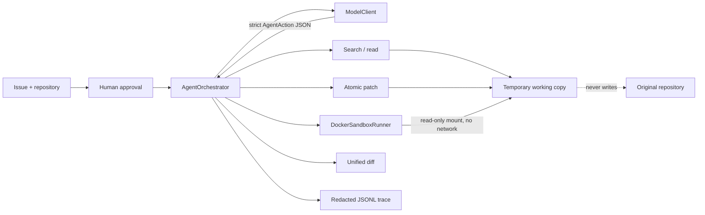

# RepoPilot architecture

RepoPilot is the product name. `issue2patch` is its Python package and CLI command.

## Runtime flow

1. Validate repository limits, create a temporary working copy, and snapshot the original.
2. Run the target tests once before the first model call. Infrastructure failures remain distinct from assertion failures.
3. Give the model only structured context and accept only five action types: fixed-string search, file read, patch, test, or finish.
4. Return file SHA-256 metadata with reads. A patch must echo the hash and pass all path, symlink, size, sensitive-file, and content checks.
5. Preflight every operation before atomically writing multiple files in the temporary copy.
6. Run tests in a network-disabled, non-root, capability-free Docker container with resource and time limits.
7. Return a unified diff and redacted trace. Verify that the original repository still matches its initial snapshot.

## Trust boundaries

| Boundary | Enforced behavior |
|---|---|
| Model output | Strict schema; no shell-command action exists |
| Filesystem | Repository-relative paths only; absolute paths, `..`, and symlink escapes are rejected |
| Modification | Expected hash, sensitive-file blocklist, byte/operation limits, full preflight, atomic replacement |
| Test execution | Docker is the default for untrusted code; network and privilege escalation are disabled |
| Secrets | API key comes only from `OPENAI_API_KEY`; traces omit source, environment, and hidden reasoning |
| Source repository | Agent tools receive a temporary copy; only its final diff is returned |

The trusted local test runner deliberately sits outside the untrusted-code boundary and is named accordingly.
